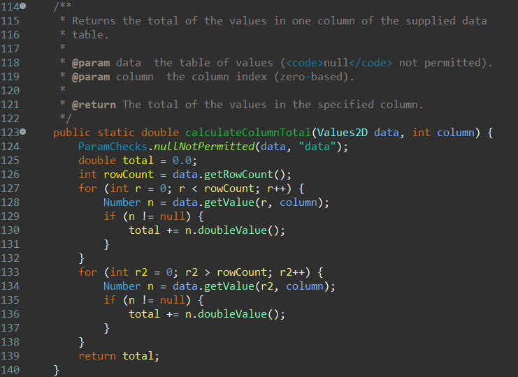
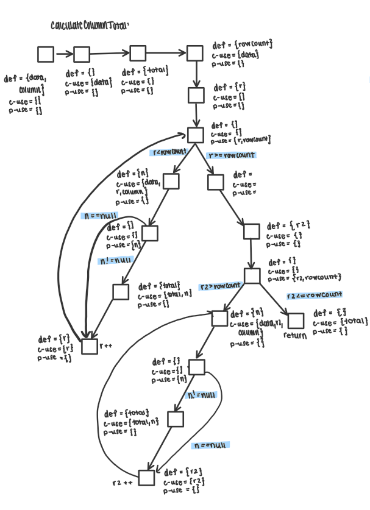
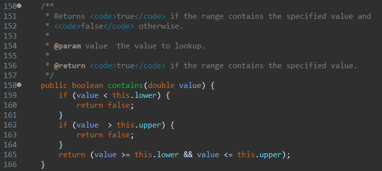
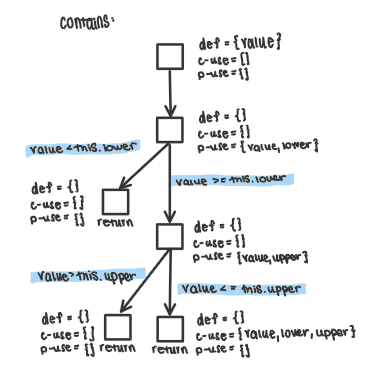
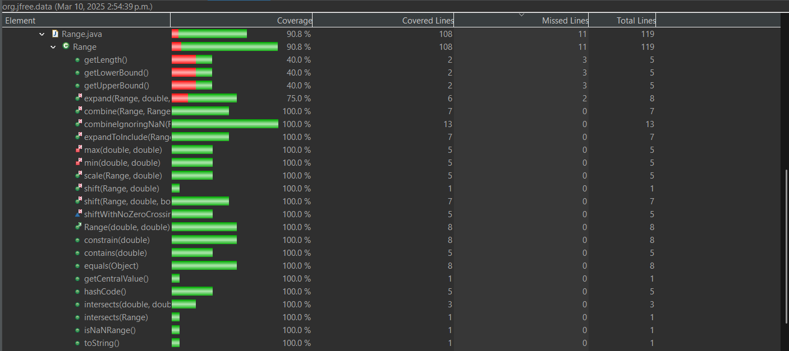
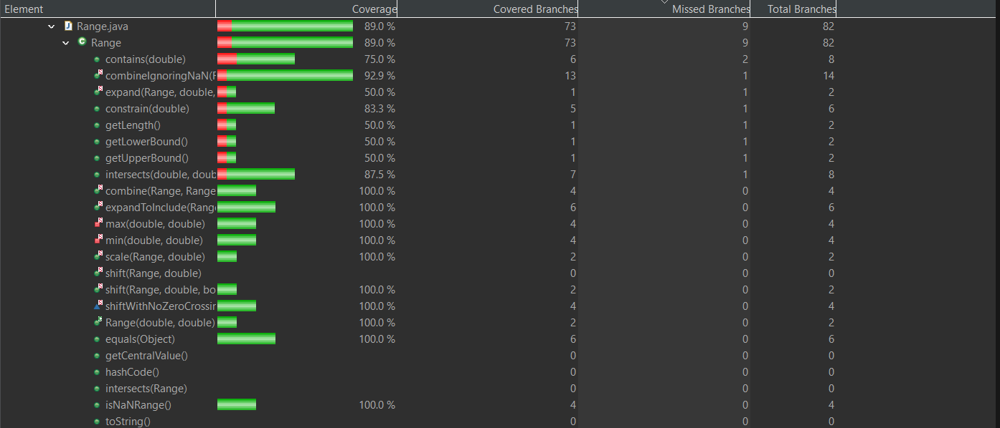
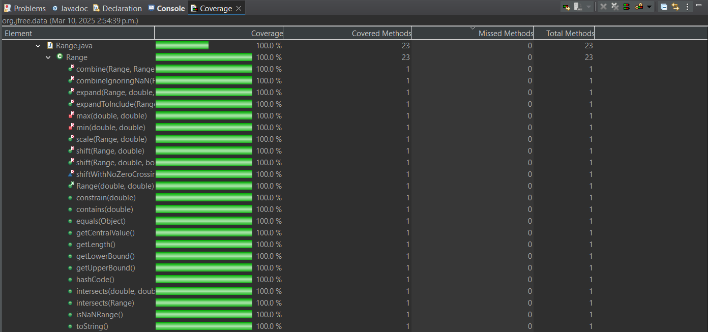

**SENG 438 - Software Testing, Reliability, and Quality**

**Lab. Report #3 – Code Coverage, Adequacy Criteria and Test Case Correlation**

| Group #:      |  22   |
| -------------- | --- |
| Student Names: |Isabelle  |
|                |Kamand    |
|                |Spiro     |
|                |Dylan     |

(Note that some labs require individual reports while others require one report
for each group. Please see each lab document for details.)

# 1 Introduction

This lab was built using our previous assignment as a foundation. We used our existing test cases for assignment 2 and expanded our unit tests for JFreeChart (the SUT) by using our chosen coverage tool EclEmma to improve our coverage. To improve test effectiveness, we used white-box testing techniques, including control flow coverage (line, branch, and method metrics) and data flow coverage (DU pair coverage). We constructed data flow graphs and identified def-use pairs to enhance our understanding of variable usage and improve test case design.

# 2 Manual data-flow coverage calculations for X and Y methods

## Method 1: DataUtilities.calculateColumnTotal

### Data flow graph

### Def-use sets per statement

| Line | Code                                                                 | DU (Definition-Use) |
|------|----------------------------------------------------------------------|---------------------|
| 1    | public static double calculateColumnTotal(Values2D data, int column) |def={data,column} c-use={} p-use={} |
| 2    | ParamChecks.nullNotPermitted(data, "data");                          |def={} c-use={data} p-use={} |
| 3    | double total = 0.0;                                                  |def={total} c-use={} p-use={} |
| 4    | int rowCount = data.getRowCount();                                   |def={rowCount} c-use={data} p-use={} |
| 5    | for (int r = 0; r < rowCount; r++)                                   |def={r} c-use={r} p-use={r, rowCount} |
| 6    | Number n = data.getValue(r, column);                                 |def={n} c-use={data,r,column} p-use={} |
| 7    | if (n != null)                                                       |def={} c-use={} p-use={n} |
| 8    | total += n.doubleValue();                                            |def={total} c-use={total,n} p-use={} |
| 9    | for (int r2 = 0; r2 > rowCount; r2++)                                |def={r2} c-use={r2} p-use={r2,rowCount} |
| 10   | Number n = data.getValue(r2, column);                                |def={n} c-use={data,r2,column} p-use={} |
| 11   | if (n != null)                                                       |def={} c-use={} p-use={n} |
| 12   | total += n.doubleValue();                                            |def={total} c-use={total,n} p-use={} |
| 13   | return total;                                                        |def={} c-use={total} p-use={} |

### All DU-pairs per variable
                                
| Variable | Def Line | Use Line          | DU Pair                                      |
|----------|----------|-------------------|----------------------------------------------|
| data     | 1        | 2, 4, 6, 10       | {1,2}, {1,4}, {1,6}, {1,10}                  |
| column   | 1        | 6, 10             | {1,6}, {1,10}                                |
| total    | 3, 8, 12 | 8, 12, 13         | {3,8}, {3,12}, {3,13}, {8,8}, {8,12}, {8,13}, {12,8}, {12,12}, {12,13} |
| rowCount | 4        | 5, 9              | {4,5}, {4,9}                                 |
| r        | 5        | 5, 6              | {5,5}, {5,6}                                 |
| n        | 6, 10    | 7, 8, 11, 12      | {6,7}, {6,8}, {6,11}, {6,12}, {10,7}, {10,8}, {10,11}, {10,12} |
| r2       | 9        | 11, 12            | {9,11}, {9,12}                               |

### Each test case show which pairs are covered

### Calculate the DU-Pair coverage.

DU-Pair Coverage = (Number of DU-pairs covered by tests/Total number of DU-pairs ) times 100% 

## Method 2: Range.contains

###  Data flow graph

###  Def-use sets per statement

| Line | Code                                                                 | DU (Definition-Use) |
|------|----------------------------------------------------------------------|---------------------|
| 1    | public boolean contains(double value)                                | def={value} c-use={} p-use={} |
| 2    | if (value < this.lower)                                              | def={} c-use={} p-use={value, this.lower} |
| 3    | return false;                                                        | def={} c-use={} p-use={} |
| 4    | if (value > this.upper)                                              | def={} c-use={} p-use={value, this.upper} |
| 5    | return false;                                                        | def={} c-use={} p-use={} |
| 6    | return (value >= this.lower && value <= this.upper);                 | def={} c-use={value, this.lower, this.upper} p-use={} |

###  All DU-pairs per variable

| Variable | Def Line | Use Line          | DU Pair                                      |
|----------|----------|-------------------|----------------------------------------------|
| value    | 1        | 2, 4, 6           | {1,2}, {1,4}, {1,6}                          |
| this.lower | -      | 2, 6              | {-,2}, {-,6}                                 |
| this.upper | -      | 4, 6              | {-,4}, {-,6}                                 |

###  Each test case show which pairs are covered

### Calculate the DU-Pair coverage.

DU-Pair Coverage = (Number of DU-pairs covered by tests/Total number of DU-pairs ) times 100% 

# 3 A detailed description of the testing strategy for the new unit test

Text…

# 4 A high level description of five selected test cases you have designed using coverage information, and how they have increased code coverage

Text…

# 5 A detailed report of the coverage achieved of each class and method (a screen shot from the code cover results in green and red color would suffice)

Line/Statement Coverage

Branch Coverage

Method Coverage

# 6 Pros and Cons of coverage tools used and Metrics you report

For our code coverage tool we chose to use EclEmma in Eclipse because it was the recommended tool as per the lab, as well as being very easy to integrate into our IDE, making it easy to use without much setup. It supports key coverage metrics like line, method, and branch coverage, which are sufficient for our project's needs. EclEmma provides real time feedback within the IDE, showing us which lines and branches are covered, which allows for immediate visibility and very easy analysis into the effectiveness of the tests we wrote. EclEmma does have some limitations, such as the lack of support for condition coverage (can be replaced with method coverage), which could have provided more detailed insights into the decision points in our code. Additionally, while the tool is lightweight and fast, it doesn't offer advanced customization or detailed reporting like some other tools do such as JaCoCo or Cobertura. Despite these drawbacks, we decided on using EclEmma due to its simplicity, ease of integration for Eclipse, and the fact that it met the basic coverage requirements for our project.

The suggested metrics to report from the lab were statement, branch, and condition coverages. Since we are using EclEmma, which does not support condition coverage, we opted to replace it with method coverage. This decision was made because method coverage still provides valuable insights into the effectiveness of testing by ensuring that each method in the code has been executed. While condition coverage maye have offered us a deeper analysis into decision points, method coverage serves as a practical substitution.

Pros: Simple integration with Eclipse, supports required coverage metrics (line, method (condition substitute), branch), gives real time in IDE feedback, lightweight and fast, free and open-source.
Cons: Lacks condition coverage, limited customization and reporting options, not as actively updated or feature-rich as other coverage tools like JaCoCo, only suitable for Java projects.

# 7 A comparison on the advantages and disadvantages of requirements-based test generation and coverage-based test generation.

Some advantages of requirements based test generation is that it ensures that all specified requirements of the system are tested, which helps in validating that the software is meeting needs and expectations of the user/client. Requirement based testing can uncover missing or ambiguous requirements by going through them each individually.

Disadvantages of coverage based testing is that it may result in execution paths or edge cases being missed by the testing, as there may be multiple paths that cover the same requirements and thus not all for them need to be tested.
For a complex system it can be really time consuming to create comprehensive tests for all requirements and it can be easy to miss some in a sizeable system. Requiring based on system requirements can not reveal defects that are not directly related to the specified requirements.

Coverage based test generation has many advantages as well. This technique makes sure that a high percentage of the code is executed during testing and can uncover defects in parts of the code that are not covered in requirements based tests. Coverage based testing can allow developers to identify dead code and untested paths/unused variables.

Disadvantages of coverage based testing is that it can result in tests that do not reflect real-world usage or requirements, for example it could be skipping an important/relevant requirement that is only a small portion of the code. It can also be very difficult to achieve 100% coverage, especially for complex codebases or very large projects. A high coverage percentage does not ensure that you can be confident in test quality, thus coverage based testing can lead to a false sense of security if high coverage is achieved but important requirements are not tested.

Overall, due to their own advantages and disadvantages, it is good to use both requirements based testing and coverage based testing together to achieve overall confidence in testing of your projects. 

# 8 A discussion on how the team work/effort was divided and managed

Isabelle: Improved old test cases and wrote new ones to improve coverage metrics of 90% statement coverage, 70% branch coverage and 60% condition coverage for the following methods: In DataUtilities; clone and equal. Drew the data flow graphs, derived the def-use sets per statement, as well as the DU pairs per variable and calculated the coverage for DataUtilities.calculateColumnTotal as well as Range.contains. Worked on completing the written report questions.

Kamand: Improved old test cases and wrote new ones to improve coverage metrics of 90% statement coverage, 70% branch coverage and 60% condition coverage for the following methods: In DataUtilities: calculateColumnTotal (Values2D data, int column), calculateColumnTotal(Values2D data, int column, int[] validRows), calculateRowTotal(Values2D data, int row), calculateRowTotal(Values2D data,int row,int[] validCols), getLength(), getCentralValue(), min and max. In Range; equals, constrain, intersects, contains, getLowerBound, and getUpperBound. Worked on completing the written report questions.

Dylan: Improved old test cases and wrote new ones to improve coverage metrics of 90% statement coverage, 70% branch coverage and 60% condition coverage for the following methods: In Data Utilities: getCumulativePercentages, In range: combine , combineIgnoreNaN, Scale, Range, hashcode. Worked on completing the written report questions.

Spiro: Improved old test cases and wrote new ones to improve coverage metrics of 90% statement coverage, 70% branch coverage and 60% condition coverage for the following methods: Data Utilities: createNumberArray, createNumberArray2D. Range: toString, expandToInclude, isNaNRange, shift, and shiftWithNoZeroCrossing. Worked on completing the written report questions.

Although we split up methods and classes to develop and improve test cases for, we used pair programming and similar review processes to review each other's code and processes.

# 9 Any difficulties encountered, challenges overcome, and lessons learned from performing the lab

One of the difficulties that we encountered was figuring out how to view different metrics in EclEmma. Initially, we struggled to find the settings and options to display various coverage metrics such as line, branch, and method coverage. We spent some time exploring the tool and using online resources to understand how to configure EclEmma to show the desired metrics. Once we got past that, the tool was very intuitive to use. Similarly we had some problems using other coverage tools which is why we ended up using EclEmma as we found it the easiest to use and it was very simple to download and use in Eclipse which helped us save time trying to figure out other tools.

Additionally, we faced some challenges in achieving high coverage for complex methods with multiple branches and conditions. We used white-box testing techniques to design more effective tests and improve coverage. This process helped us gain a deeper understanding of the code and identify areas that required more thorough testing.

# 10 Comments/feedback on the lab itself

This lab assignment provided valuable insights into the importance of code coverage and the use of coverage tools (such as EclEmma) in software testing. We learned how to effectively use EclEmma to measure and improve our test coverage, and the experience highlighted the need for continuous learning and adaptation in software development. It also helped us compare and see the differences of requirement based and coverage based test generation and further consider their advantages and consequences. We liked that we were able to build this lab off of the existing assignment work and tests we had created for the previous lab as it got rid of some of the time usually spent on understanding the test environment and setup which takes a while. We found the lab instructions however were a bit misleading. Some points (especially regarding the use of coverage tools) were hard to follow and it was unclear what the expectations of us were and how many tools were required to be used. We found this confusion in other sections as well.
