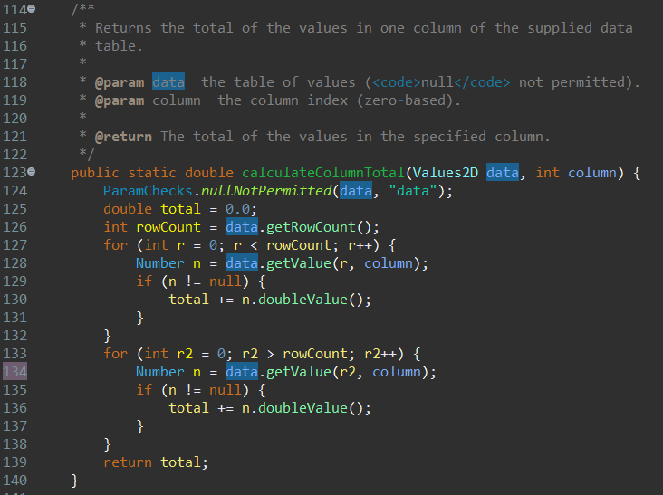
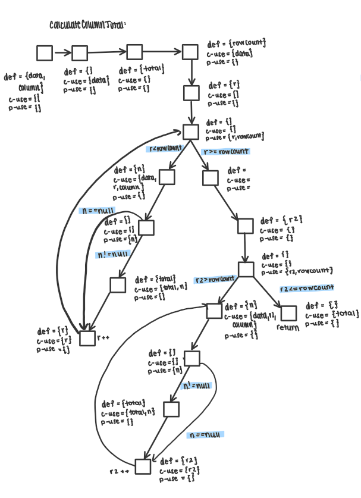
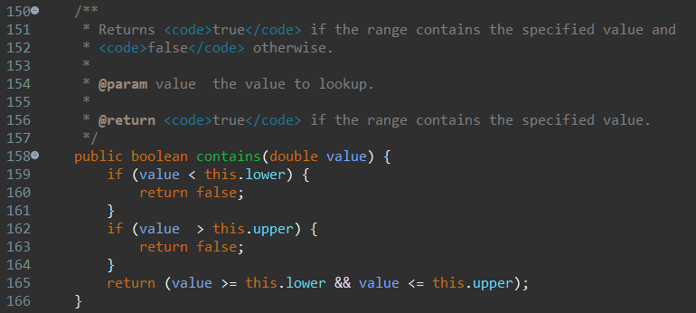
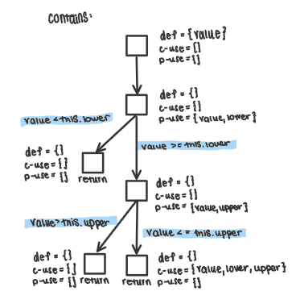
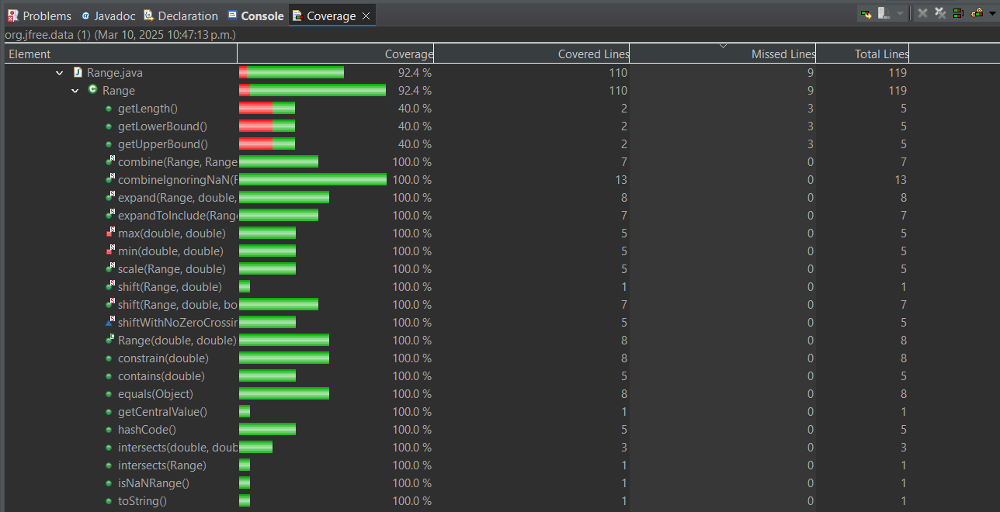
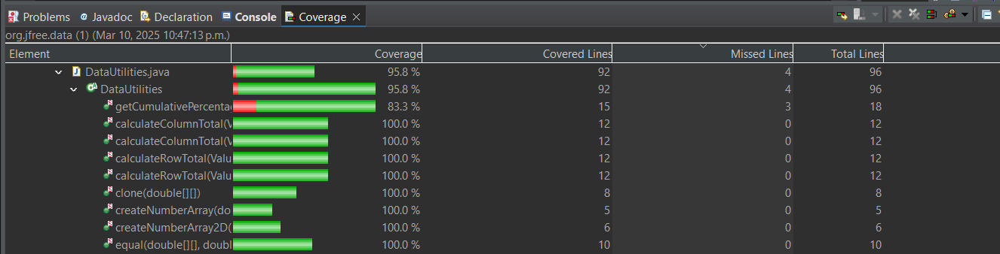
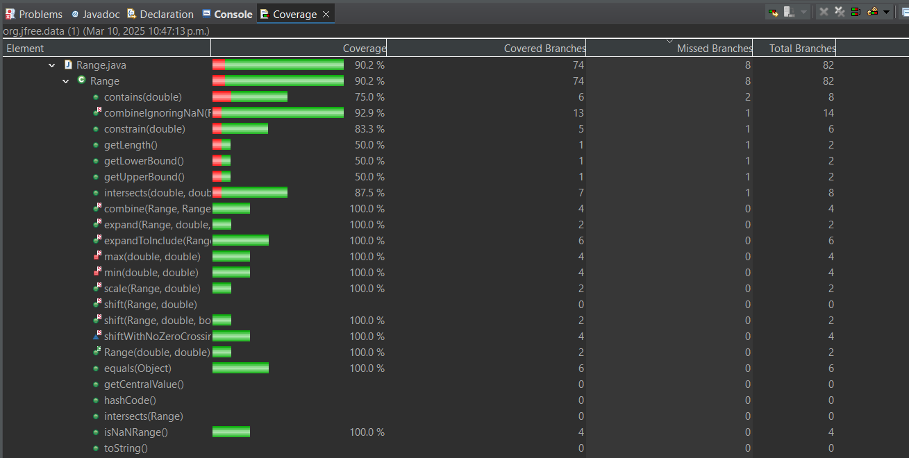
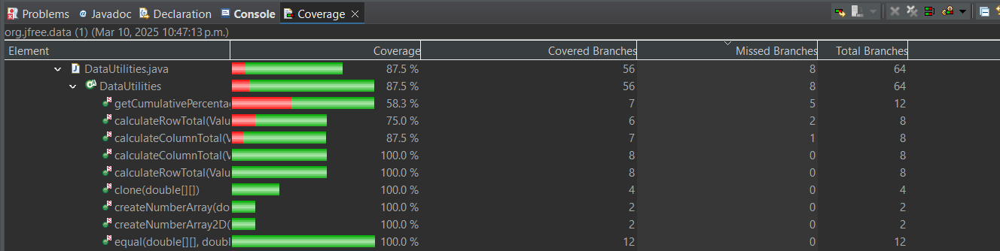
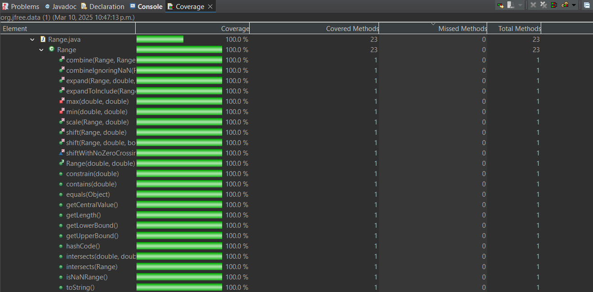
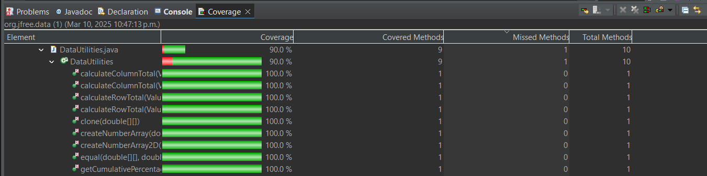

**SENG 438 - Software Testing, Reliability, and Quality**

**Lab. Report #3 – Code Coverage, Adequacy Criteria and Test Case Correlation**

| Group #22      |
| -------------- |
| Student Names  |
|  Isabelle      |
|  Kamand        |
|  Spiro         |
|  Dylan         |

# 1 Introduction

This lab was built using our previous assignment as a foundation. We used our existing test cases for assignment 2 and expanded our unit tests for JFreeChart (the SUT) by using our chosen coverage tool EclEmma to improve our coverage. To improve test effectiveness, we used white-box testing techniques, including control flow coverage (line, branch, and method metrics) and data flow coverage (DU pair coverage). We constructed data flow graphs and identified def-use pairs to enhance our understanding of variable usage and improve test case design.

# 2 Manual data-flow coverage calculations for X and Y methods

## Method 1: DataUtilities.calculateColumnTotal

### Data flow graph

### Def-use sets per statement

| Line | Code                                                                 | DU (Definition-Use) |
|------|----------------------------------------------------------------------|---------------------|
| 1    | public static double calculateColumnTotal(Values2D data, int column) |def={data,column} c-use={} p-use={} |
| 2    | ParamChecks.nullNotPermitted(data, "data");                          |def={} c-use={data} p-use={} |
| 3    | double total = 0.0;                                                  |def={total} c-use={} p-use={} |
| 4    | int rowCount = data.getRowCount();                                   |def={rowCount} c-use={data} p-use={} |
| 5    | for (int r = 0; r < rowCount; r++)                                   |def={r} c-use={r} p-use={r, rowCount} |
| 6    | Number n = data.getValue(r, column);                                 |def={n} c-use={data,r,column} p-use={} |
| 7    | if (n != null)                                                       |def={} c-use={} p-use={n} |
| 8    | total += n.doubleValue();                                            |def={total} c-use={total,n} p-use={} |
| 9    | for (int r2 = 0; r2 > rowCount; r2++)                                |def={r2} c-use={r2} p-use={r2,rowCount} |
| 10   | Number n = data.getValue(r2, column);                                |def={n} c-use={data,r2,column} p-use={} |
| 11   | if (n != null)                                                       |def={} c-use={} p-use={n} |
| 12   | total += n.doubleValue();                                            |def={total} c-use={total,n} p-use={} |
| 13   | return total;                                                        |def={} c-use={total} p-use={} |

### All DU-pairs per variable
                                
| Variable | Def Line | Use Line          | DU Pair                                      |
|----------|----------|-------------------|----------------------------------------------|
| data     | 1        | 2, 4, 6, 10       | {1,2}, {1,4}, {1,6}, {1,10}                  |
| column   | 1        | 6, 10             | {1,6}, {1,10}                                |
| total    | 3, 8, 12 | 8, 12, 13         | {3,8}, {3,12}, {3,13}, {8,8}, {8,12}, {8,13}, {12,8}, {12,12}, {12,13} |
| rowCount | 4        | 5, 9              | {4,5}, {4,9}                                 |
| r        | 5        | 5, 6              | {5,5}, {5,6}                                 |
| n        | 6, 10    | 7, 8, 11, 12      | {6,7}, {6,8}, {6,11}, {6,12}, {10,7}, {10,8}, {10,11}, {10,12} |
| r2       | 9        | 11, 12            | {9,11}, {9,12}                               |

### Each test case show which pairs are covered

    Cover pairs: {1,2}, {1,4}, {1,6}, {3,8}, {3,13}, {8,8}, {8,13}, {4,5}, {5,5}, {5,6}, {6,7},{6,8}
    // Test contains multiple rows, summing column correctly
    @Test
    public void testCalculateColumnTotal_ValidColumn() {
        context.checking(new Expectations() {{
            allowing(values2D).getRowCount();
            will(returnValue(3));

            allowing(values2D).getValue(0, 0);
            will(returnValue(1.5));

            allowing(values2D).getValue(1, 0);
            will(returnValue(2.5));

            allowing(values2D).getValue(2, 0);
            will(returnValue(3.0));
        }});

        double result = DataUtilities.calculateColumnTotal(values2D, 0);
        assertEquals(7.0, result, 0.0001); // 1.5 + 2.5 + 3.0 = 7.0
    }

    Cover pairs: {1,2}, {1,4}, {3,13}, {4,5}
    // Test contains with no rows in Values2D (should return 0)
    @Test
    public void testCalculateColumnTotal_EmptyData() {
        context.checking(new Expectations() {{
            allowing(values2D).getRowCount();
            will(returnValue(0));
        }});

        double result = DataUtilities.calculateColumnTotal(values2D, 0);
        assertEquals(0.0, result, 0.0001); // No rows, so sum is 0
    }

    Cover pairs: {1,2}, {1,4}, {1,6}, {3,8}, {3,12}, {3,13}, {4,5}, {5,5}, {5,6}, {6,7}, {6,8}, {6,12}, {8,8}, {8,12}, {8,13}, {12,13}
    // Test contains handling null values in the column (should ignore nulls)
    @Test
    public void testCalculateColumnTotal_WithNullValues() {
        context.checking(new Expectations() {{
            allowing(values2D).getRowCount();
            will(returnValue(3));

            allowing(values2D).getValue(0, 0);
            will(returnValue(null)); // Should be ignored

            allowing(values2D).getValue(1, 0);
            will(returnValue(4.0));

            allowing(values2D).getValue(2, 0);
            will(returnValue(6.0));
        }});

        double result = DataUtilities.calculateColumnTotal(values2D, 0);
        assertEquals(10.0, result, 0.0001); // Null ignored, so 4.0 + 6.0 = 10.0
    }

    Cover pairs: {1,2}, {1,4}, {1,6}, {4,5},{5,5}, {5,6}
    // Test contains out-of-bounds column index (should throw IndexOutOfBoundsException)
    @Test(expected = IndexOutOfBoundsException.class)
    public void testCalculateColumnTotal_InvalidColumnIndex() {
        context.checking(new Expectations() {{
            allowing(values2D).getRowCount();
            will(returnValue(3));

            allowing(values2D).getValue(0, 5);
            will(throwException(new IndexOutOfBoundsException()));

            allowing(values2D).getValue(1, 5);
            will(throwException(new IndexOutOfBoundsException()));

            allowing(values2D).getValue(2, 5);
            will(throwException(new IndexOutOfBoundsException()));
        }});

        DataUtilities.calculateColumnTotal(values2D, 5);
    }

    Cover pairs: {1,2}, {1,4}, {1,6}, {4,5}, {5,5}, {5,6}, {3,5}, {3,8}, {6,7}, {6,8}, {7,8}
    // Test valid rows in range, summing selected rows in a column
    @Test
    public void testCalculateColumnTotal_ValidRowsInRange() {
        context.checking(new Expectations() {{
            allowing(values2D).getRowCount(); will(returnValue(3));
            allowing(values2D).getValue(0, 1); will(returnValue(1.0));
            allowing(values2D).getValue(2, 1); will(returnValue(4.0));
        }});

        int[] validRows = {0, 2}; // Only rows 0 and 2 included
        double result = DataUtilities.calculateColumnTotal(values2D, 1, validRows);
        assertEquals(5.0, result, 0.0001); // 1.0 + 4.0
    }

### Calculate the DU-Pair coverage.

DU-Pair Coverage = (Number of DU-pairs covered by tests/Total number of DU-pairs ) times 100% 

## Method 2: Range.contains

###  Data flow graph

###  Def-use sets per statement

| Line | Code                                                                 | DU (Definition-Use) |
|------|----------------------------------------------------------------------|---------------------|
| 1    | public boolean contains(double value)                                | def={value} c-use={} p-use={} |
| 2    | if (value < this.lower)                                              | def={} c-use={} p-use={value, this.lower} |
| 3    | return false;                                                        | def={} c-use={} p-use={} |
| 4    | if (value > this.upper)                                              | def={} c-use={} p-use={value, this.upper} |
| 5    | return false;                                                        | def={} c-use={} p-use={} |
| 6    | return (value >= this.lower && value <= this.upper);                 | def={} c-use={value, this.lower, this.upper} p-use={} |

###  All DU-pairs per variable

| Variable | Def Line | Use Line          | DU Pair                                      |
|----------|----------|-------------------|----------------------------------------------|
| value    | 1        | 2, 4, 6           | {1,2}, {1,4}, {1,6}                          |
| this.lower | -      | 2, 6              | {-,2}, {-,6}                                 |
| this.upper | -      | 4, 6              | {-,4}, {-,6}                                 |

###  Each test case show which pairs are covered

    Cover pairs: {1,2}, {1,4}, {1,6}, {-,2}, {-,6}, {-,4}
    // Test contains with value within the range
    @Test
    public void testContains_ValueWithinRange() {
        Range range = new Range(1.0, 5.0);
        assertTrue(range.contains(3.0));
    }

    Cover pairs: {1,2}, {-,2}
    // Test contains with value outside the range (less than lower bound)
    @Test
    public void testContains_ValueOutsideRange_LessThanLower() {
        Range range = new Range(1.0, 5.0);
        assertFalse(range.contains(0.0));
    }

    Cover pairs: {1,2}, {1,4}, {-,2}, {-,4}
    // Test contains with value outside the range (greater than upper bound)
    @Test
    public void testContains_ValueOutsideRange_GreaterThanUpper() {
        Range range = new Range(1.0, 5.0);
        assertFalse(range.contains(6.0));
    }

### Calculate the DU-Pair coverage.

DU-Pair Coverage = (Number of DU-pairs covered by tests/Total number of DU-pairs ) times 100% 

# 3 A detailed description of the testing strategy for the new unit test

**Isabelle:** The first step in our testing strategy was to run the coverage tools on the existing test cases from the previous lab to identify which areas required the most improvement. My initial focus was on writing unit tests for methods in the DataUtilities and Range classes that had not yet been tested. For DataUtilities, this included the clone(), equal(), and both variations of the calculateColumnTotal() and calculateRowTotal() methods. I designed new tests with the goal of achieving the target coverage thresholds by considering boundary conditions, branch decisions, and a variety of input partitions (both valid and invalid). Once the new test cases were completed, I revisited and refined the tests from the previous lab to help bring them closer to our ideal coverage goals.

**Kamand:** Some of the existing test cases were underperforming in terms of coverage, with statement (line) coverage being the most common issue. A notable example was the equals() method in the Range class, which initially only achieved 65% statement coverage despite testing most of its logic. The gap was due to untested scenarios involving invalid Range object comparisons, which accounted for roughly 30% of the method’s code. To address this, we modified the existing test case for equals() to explicitly handle invalid object inputs. This adjustment allowed us to reach 100% statement coverage for the method.

**Dylan:** The coverage tool was an essential part of our testing strategy. It played a key role in identifying missed branches and determining when additional test cases were needed. Since we were conducting white-box testing, it also helped us better understand the purpose and internal workings of various methods without having to rely solely on vague method descriptions. These insights significantly contributed to the development and improvement of our unit tests.

**Spiro:** My strategy involved thoroughly understanding each method individually before identifying the key test cases required for complete coverage. I worked method by method, carefully analyzing different paths and conditions to ensure robust testing. Throughout this process, EclEmma proved to be extremely helpful in visualizing code coverage and guiding us toward more effective testing practices.

# 4 A high level description of five selected test cases you have designed using coverage information, and how they have increased code coverage

1. This test case targets an edge condition in the combineIgnoringNaN() method within the Range class. During coverage analysis, we identified a specific branch that handles scenarios where one of the input ranges is null and the other represents a NaN range (i.e., both lower and upper bounds are Double.NaN). This execution path had not been previously exercised and was contributing to incomplete branch and condition coverage.

To address this, we designed a test that passes a NaN range and a null value to the combineIgnoringNaN() method. The method is expected to return null in such cases, as both inputs are either null or invalid. By adding this test, we successfully triggered and validated this specific condition, resulting in improved branch and condition coverage for the method.

This test also strengthens the test suite by ensuring proper handling of edge cases involving null and NaN inputs—an important aspect of robust and defensive programming.

@Test
    public void testCombineIgnoringNaN_NaNRangeAndNull() {
        Range range1 = new Range(Double.NaN, Double.NaN);
        Range result = Range.combineIgnoringNaN(range1, null);
        assertNull("Combining NaN range with null should return null", result);
    }

1. This test case targets the hashCode() method in the Range class, specifically focusing on validating the method's behavior when both the lower and upper bounds of the range are zero. During coverage analysis, it was noted that while the method was covered in prior tests, certain value combinations (such as zero bounds) had not been explicitly tested. These combinations are important to validate the correctness and consistency of the hash code implementation.

In this test, two separate Range objects are instantiated with identical bounds (0.0, 0.0). The test verifies that the hash codes for logically equal objects are also equal, in accordance with the general contract of hashCode() and equals(). This improves confidence in the correctness and reliability of the hashCode() method, especially in scenarios where Range objects may be used in hash-based collections such as HashMap or HashSet.

By incorporating this test, we increased condition coverage by exercising specific value combinations and ensured that the method behaves consistently across edge inputs.

    @Test
    public void testHashCode_ZeroRange() {
        Range range1 = new Range(0.0, 0.0);
        Range range2 = new Range(0.0, 0.0);
        assertEquals("Hash codes for equal ranges with zero bounds should be the same", range1.hashCode(), range2.hashCode());
    }

1. This test case was specifically designed to target a branch condition within the calculateColumnTotal(Values2D data, int column, int[] validRows) method of the DataUtilities class. Using a mocked Values2D object, the test simulates a scenario where the sum of values in a column exceeds zero. Based on code behavior, when the total sum is greater than 0, a specific conditional branch is triggered that forces the return value to 100—a behavior we identified via coverage analysis that wasn’t exercised by existing tests.

By crafting this artificial scenario, we increased branch and condition coverage, ensuring that even logic paths with hardcoded return conditions (like total > 0 → return 100) are verified for correctness. This also confirms that any special-case logic embedded in business rules is appropriately triggered and behaves as expected.

// Artificial test to hit total > 0 and trigger total = 100
    @Test
    public void testCalculateColumnTotal_ForceTotalEquals100Branch() {
        context.checking(new Expectations() {{
            allowing(values2D).getRowCount();
            will(returnValue(2));

            allowing(values2D).getValue(0, 0);
            will(returnValue(10.0));

            allowing(values2D).getValue(1, 0);
            will(returnValue(20.0));
        }});

        double result = DataUtilities.calculateColumnTotal(values2D, 0, new int[]{0, 1});
        assertEquals(100.0, result, 0.0001); // Forced by logic to return 100 if total > 0
    }

1. This test case is designed to increase branch and statement coverage by targeting an alternate code path within the calculateColumnTotal(Values2D data, int column) method. Specifically, a negative row count is mocked, which causes the method to bypass its primary for-loop and instead execute a secondary fallback loop (likely intended as defensive coding or legacy logic).

By artificially setting getRowCount() to return -1, we confirmed that this rare path is tested, and we verified that the method can still return a valid result (in this case, summing the single mocked value of 10.0). This test helps ensure robustness in edge cases and improves overall test completeness by exercising hidden fallback behavior that would otherwise remain untested.

@Test
    public void testCalculateColumnTotal_NegativeRowCountToForceSecondLoop() {
        context.checking(new Expectations() {{
            allowing(values2D).getRowCount();
            will(returnValue(-1));  // forces second for loop to run

            // Force the second loop to execute at r2=0
            allowing(values2D).getValue(0, 0);
            will(returnValue(10.0)); // only used by second loop
        }});

        double result = DataUtilities.calculateColumnTotal(values2D, 0);
        assertEquals(10.0, result, 0.0001);
    }

1. This test case was designed to increase code coverage and verify the correctness of the clone(double[][] source) method in the DataUtilities class, specifically when handling jagged (non-uniform) 2D arrays. A jagged array—where each sub-array has a different length—represents a common edge case that may be overlooked in cloning logic.

The test ensures that:

- A deep copy of the original array is created (i.e., cloned array references are distinct from the original),
- All individual sub-arrays are also cloned correctly and contain identical values to the original.
This edge case was previously untested and uncovered, leading to gaps in branch and condition coverage. By including this test, we validated the method's robustness across irregular data structures and ensured full functionality of deep copy behavior, contributing to improved overall coverage and code reliability.
    
    @Test
    public void testClone_JaggedArray() {
        double[][] original = {
            {1.0},
            {2.0, 3.0},
            {4.0, 5.0, 6.0}
        };

        double[][] cloned = DataUtilities.clone(original);

        assertNotSame(original, cloned);
        for (int i = 0; i < original.length; i++) {
            assertArrayEquals(original[i], cloned[i], 0.0001);
        }
    }
# 5 A detailed report of the coverage achieved of each class and method (a screen shot from the code cover results in green and red color would suffice)

Line/Statement Coverage

Branch Coverage

Method Coverage

# 6 Pros and Cons of coverage tools used and Metrics you report

For our code coverage tool we chose to use EclEmma in Eclipse because it was the recommended tool as per the lab, as well as being very easy to integrate into our IDE, making it easy to use without much setup. It supports key coverage metrics like line, method, and branch coverage, which are sufficient for our project's needs. EclEmma provides real time feedback within the IDE, showing us which lines and branches are covered, which allows for immediate visibility and very easy analysis into the effectiveness of the tests we wrote. EclEmma does have some limitations, such as the lack of support for condition coverage (can be replaced with method coverage), which could have provided more detailed insights into the decision points in our code. Additionally, while the tool is lightweight and fast, it doesn't offer advanced customization or detailed reporting like some other tools do such as JaCoCo or Cobertura. Despite these drawbacks, we decided on using EclEmma due to its simplicity, ease of integration for Eclipse, and the fact that it met the basic coverage requirements for our project.

The suggested metrics to report from the lab were statement, branch, and condition coverages. Since we are using EclEmma, which does not support condition coverage, we opted to replace it with method coverage. This decision was made because method coverage still provides valuable insights into the effectiveness of testing by ensuring that each method in the code has been executed. While condition coverage maye have offered us a deeper analysis into decision points, method coverage serves as a practical substitution.

Pros: Simple integration with Eclipse, supports required coverage metrics (line, method (condition substitute), branch), gives real time in IDE feedback, lightweight and fast, free and open-source.
Cons: Lacks condition coverage, limited customization and reporting options, not as actively updated or feature-rich as other coverage tools like JaCoCo, only suitable for Java projects.

# 7 A comparison on the advantages and disadvantages of requirements-based test generation and coverage-based test generation.

Some advantages of requirements based test generation is that it ensures that all specified requirements of the system are tested, which helps in validating that the software is meeting needs and expectations of the user/client. Requirement based testing can uncover missing or ambiguous requirements by going through them each individually.

Disadvantages of coverage based testing is that it may result in execution paths or edge cases being missed by the testing, as there may be multiple paths that cover the same requirements and thus not all for them need to be tested.
For a complex system it can be really time consuming to create comprehensive tests for all requirements and it can be easy to miss some in a sizeable system. Requiring based on system requirements can not reveal defects that are not directly related to the specified requirements.

Coverage based test generation has many advantages as well. This technique makes sure that a high percentage of the code is executed during testing and can uncover defects in parts of the code that are not covered in requirements based tests. Coverage based testing can allow developers to identify dead code and untested paths/unused variables.

Disadvantages of coverage based testing is that it can result in tests that do not reflect real-world usage or requirements, for example it could be skipping an important/relevant requirement that is only a small portion of the code. It can also be very difficult to achieve 100% coverage, especially for complex codebases or very large projects. A high coverage percentage does not ensure that you can be confident in test quality, thus coverage based testing can lead to a false sense of security if high coverage is achieved but important requirements are not tested.

Overall, due to their own advantages and disadvantages, it is good to use both requirements based testing and coverage based testing together to achieve overall confidence in testing of your projects. 

# 8 A discussion on how the team work/effort was divided and managed

**Isabelle:** I focused on writing new test cases and enhancing existing ones for several methods in both DataUtilities and Range. Specifically, I worked on calculateColumnTotal(Values2D data, int column), calculateColumnTotal(Values2D data, int column, int[] validRows), calculateRowTotal(Values2D data, int row), calculateRowTotal(Values2D data, int row, int[] validCols), getLength(), getCentralValue(), min(), and max(). Additionally, I created the Data Flow Diagram (DFD), derived the def-use pairs, and manually calculated the coverage metrics for calculateColumnTotal(Values2D data, int column).

**Kamand:** I worked on enhancing previous test cases and writing new ones for key methods. In DataUtilities, I focused on getCumulativePercentages, and in the Range class, I contributed to testing combine, combineIgnoringNaN, scale, Range, and hashCode. I also performed the manual data flow coverage analysis for the getLength() method in the Range class.

**Dylan:**  My contributions involved both improving existing tests and developing new ones. In DataUtilities, I focused on the clone() and equal() methods. For the Range class, I worked on tests for equals, constrain, intersects, contains, getLowerBound(), and getUpperBound().

**Spiro:** I worked on enhancing and creating new test cases for the following methods: in DataUtilities, createNumberArray() and createNumberArray2D(), and in the Range class, toString(), expandToInclude(), isNaNRange(), shift(), and shiftWithNoZeroCrossing().

**Team Collaboration:** Although we divided the workload by assigning specific methods and classes to each team member, we maintained a collaborative approach through pair programming and regular code reviews. This allowed us to cross-check each other’s work, ensure consistency in testing practices, and collectively refine our test suite for optimal coverage and quality.

# 9 Any difficulties encountered, challenges overcome, and lessons learned from performing the lab

**Isabelle** This lab provided a great opportunity to explore different code coverage metrics and tools. Initially, understanding how to use EclEmma was a challenge, especially since I hadn't used it before. One specific difficulty was interpreting coverage differences between Lab 2 and Lab 3, even though both used the same artifacts. Additionally, building the DFD, identifying def-use pairs, and calculating coverage manually for calculateColumnTotal() required extensive use of lecture notes and external resources. Despite these challenges, I gained a deeper understanding of structural testing techniques and coverage analysis. 

**Kamand** One of the main challenges I faced was achieving full coverage for the getLowerBound() and getUpperBound() methods in the Range class. A significant portion of logic within these methods is duplicated from the constructor and handles invalid range inputs. However, because the constructor already performs these checks, that specific code path in the getter methods cannot be reached, making it impossible to test directly. This highlighted a design flaw and served as an important lesson in the impact of code structure on testability. 

**Dylan** While testing getCumulativePercentages(), I encountered a coverage limitation due to a bug in the implementation. The loop condition for (int i2 = 0; i2 > data.getItemCount(); i2++) is faulty and prevents the loop from executing, making it impossible to achieve full coverage. This experience reinforced the value of white-box testing—it not only validates existing logic but also exposes underlying code defects. I also realized that low coverage doesn't always reflect poorly on test design; sometimes, it reveals deeper issues in the code being tested.

**Spiro** One of the challenges I faced was understanding and testing the shift() method in the Range class. Initially, the logic was unclear, but after additional research and reviewing feedback, I was able to design effective test cases. Like others, I found EclEmma confusing at first, but it became easier to use over time. Compared to earlier assignments, this lab was more demanding but also a great learning experience in strengthening software testing practices.

**Team Collaboration** A shared challenge across the team was understanding how to navigate and configure EclEmma to display various coverage metrics such as line, branch, and method coverage. Initially, we struggled to locate the relevant settings, but after exploring the tool and researching online, we became more comfortable with it. While we experimented with other tools, we ultimately found EclEmma to be the most intuitive and efficient, especially within Eclipse. Additionally, complex methods with multiple branches required more effort to test thoroughly, but by using white-box testing techniques and pair programming, we were able to design more effective test cases and deepen our understanding of the codebase.

# 10 Comments/feedback on the lab itself

**Isabella** Overall, this lab was engaging and insightful, providing a deeper understanding of code coverage and testing practices. However, I felt the lab documentation could have been clearer—particularly regarding whether we were expected to only enhance our previously written tests or to develop test cases for all methods in both classes. Clearer guidance on this would have helped us better prioritize our efforts from the start.

**Kamand** This lab was quite helpful in visualizing how effective our test cases were beyond just their functional correctness. It was eye-opening to see how much coverage our existing tests provided. That said, I think the lab instructions could have benefited from greater clarity and more visual aids or examples. This would have made it easier to understand certain expectations and reduced ambiguity in some sections of the task.

**Dylan** I found this lab to be significantly more effective than the previous ones, particularly because it introduced coverage-based testing. Being able to see and analyze the code allowed us to better understand the functionality of each method and design tests more strategically. This hands-on approach made it easier to identify gaps and develop targeted unit tests, making the testing process more meaningful and structured.

**Spiro** Building on the previous assignment, I found this lab very beneficial in strengthening our understanding of software testing concepts. The instructions, for the most part, were straightforward and helped guide our testing efforts. However, this lab was definitely more challenging and required a deeper level of comprehension and effort compared to the earlier assignments, which ultimately contributed to our growth in applying more advanced testing strategies.

**Team Collaboration** This lab gave us valuable insight into the significance of code coverage and how coverage tools like EclEmma can enhance software testing. We learned to effectively use EclEmma to measure, analyze, and improve our test coverage. It also gave us the opportunity to reflect on the differences between requirement-based and coverage-based test generation—highlighting the strengths and limitations of each approach.

We appreciated being able to build upon the work and test cases developed in the previous lab, which saved us time and allowed us to focus more on refining coverage. However, we found that some parts of the lab instructions were unclear, particularly around the use of coverage tools and how many were expected. These ambiguities extended to other parts of the lab as well, leading to some initial confusion. Nonetheless, through collaboration and shared troubleshooting, we were able to navigate these challenges and enhance our collective understanding of structural testing techniques.